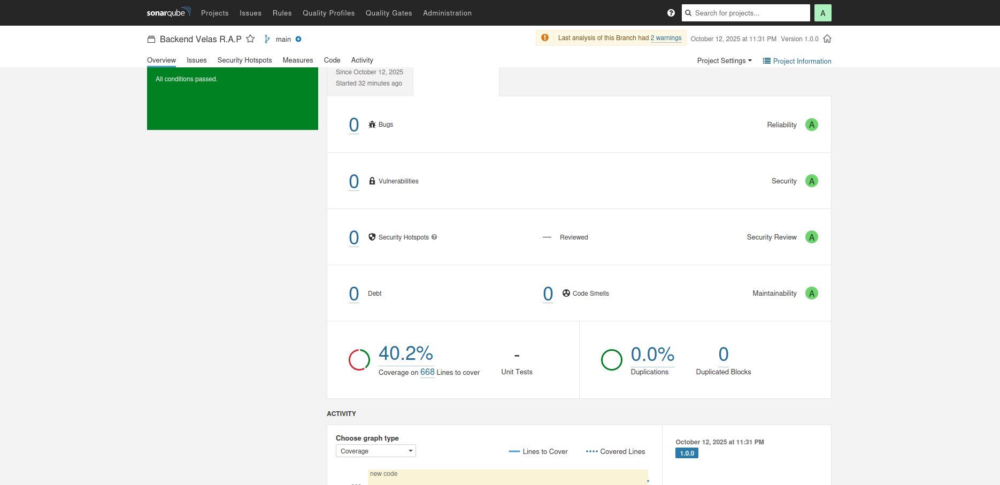

# SonarQube Implementation with CI/CD Pipeline

Este proyecto implementa una solución completa de análisis de calidad de código y seguridad utilizando **SonarQube** y **Trivy** en una máquina virtual, integrado con pipelines de **GitHub Actions**.

## 🏗️ Arquitectura de la Solución

### Componentes Principales

1. **Infraestructura como Código (Terraform)**
   - Máquina virtual en Azure
   - Configuración automatizada con cloud-init
   - SonarQube Community LTS
   - PostgreSQL como base de datos
   - Trivy para análisis de seguridad

2. **Pipeline de CI/CD (GitHub Actions)**
   - Análisis automático de calidad de código
   - Escaneo de vulnerabilidades de seguridad
   - Generación de reportes de cobertura
   - Integración con GitHub Security

## 🚀 Implementación

### 1. Infraestructura

La infraestructura se despliega usando Terraform con los siguientes componentes:

```
terraform/
├── main.tf           # Recursos principales de Azure
├── variables.tf      # Variables de configuración
├── outputs.tf        # Outputs del despliegue
└── cloud-init.yaml   # Script de inicialización de VM
```

**Servicios desplegados en la VM:**
- **SonarQube Community LTS**: Puerto 9000
- **PostgreSQL 13**: Base de datos para SonarQube
- **Trivy**: Scanner de vulnerabilidades
- **Docker**: Containerización de servicios


## 📊 Resultados

### GitHub Security Dashboard


El dashboard de seguridad de GitHub muestra:
- ✅ Vulnerabilidades detectadas y clasificadas
- ✅ Integración automática con Trivy
- ✅ Reportes en formato SARIF
- ✅ Seguimiento de issues de seguridad

### SonarQube Dashboard


El análisis de SonarQube proporciona:
- ✅ Métricas de calidad de código
- ✅ Cobertura de tests (unitarios + e2e)
- ✅ Análisis de duplicación de código
- ✅ Métricas de mantenibilidad

## 🛠️ Tecnologías Utilizadas

### Infraestructura
- **Terraform**: Infrastructure as Code
- **Azure**: Proveedor de nube
- **Docker**: Containerización
- **Cloud-init**: Configuración automática de VM

### Análisis de Código
- **SonarQube Community LTS**: Análisis de calidad
- **Trivy**: Scanner de vulnerabilidades
- **Jest**: Framework de testing
- **GitHub Actions**: CI/CD Pipeline

### Backend Application
- **NestJS**: Framework de Node.js
- **TypeScript**: Lenguaje principal
- **PostgreSQL**: Base de datos
- **Jest**: Testing framework


## 🔧 Configuración

### Configuración de SonarQube

```properties
# sonar-project.properties
sonar.projectKey=velas-backend
sonar.projectName=Velas Backend
sonar.sources=src
sonar.tests=src,test
sonar.javascript.lcov.reportPaths=coverage/lcov.info
sonar.coverage.exclusions=**/*.spec.ts,**/*.dto.ts,**/*.module.ts
```

## 🚦 Pipeline Workflow

1. **Trigger**: Push a `main` o `develop` / Pull Request a `main`
2. **Build**: Instalación de dependencias
3. **Test**: Ejecución de tests unitarios y e2e con cobertura
4. **SonarQube**: Análisis de calidad de código
5. **Trivy**: Escaneo de vulnerabilidades
6. **Security**: Upload de reportes SARIF a GitHub